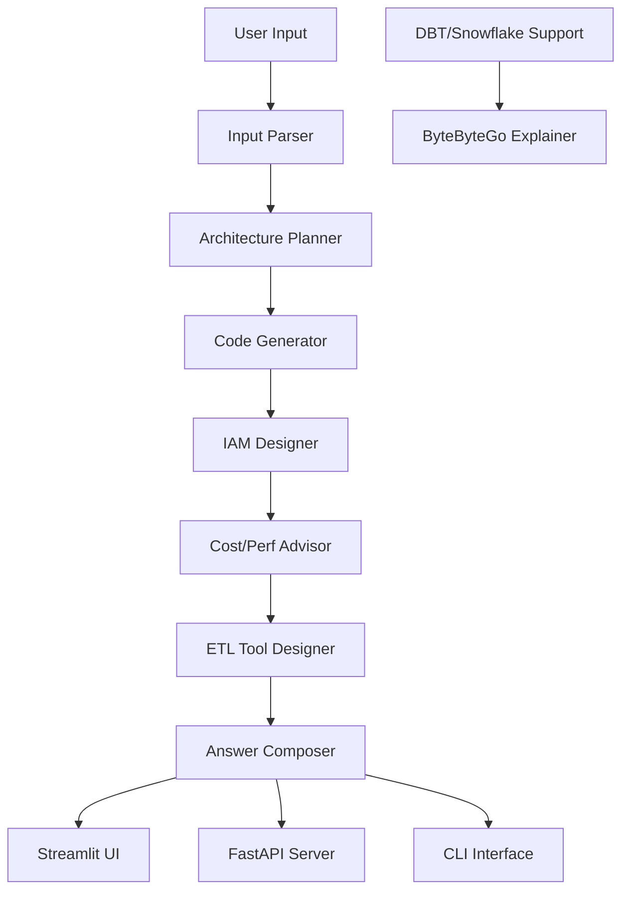

<<<<<<< HEAD
# pipeline-architect
Enterprise AI assistant for designing end-to-end data pipelines with cloud architecture, PySpark code, and ETL tool support
=======
# 🧠 Pipeline Architect - AI Data Pipeline Design Assistant

[](LICENSE)
[](https://python.org)
[](https://langchain-ai.github.io/langgraph/)
[](https://fastapi.tiangolo.com/)
[](https://streamlit.io)
[](https://docs.anthropic.com/)
[](https://github.com/pipeline-architect/pipeline-architect/actions)
[](https://github.com/pipeline-architect/pipeline-architect)
[](https://github.com/pipeline-architect/pipeline-architect)

> **Enterprise-grade AI assistant that designs end-to-end data pipelines with cloud architecture, PySpark code, IAM design, and ETL tool support**

## 🚀 What is Pipeline Architect? Curious ?

Pipeline Architect is a production-ready AI assistant that transforms natural language pipeline descriptions into complete, enterprise-grade data pipeline designs. Built with LangGraph, FastAPI, and Anthropic's Claude, it provides:

- **🏗️ Complete Architecture Design** - Azure, AWS, GCP, streaming & batch architectures
- **💻 Production Code Generation** - PySpark, Databricks, and cloud-native implementations  
- **🔐 Enterprise Security** - IAM design, PII masking, zero-trust security patterns
- **⚡ Performance Optimization** - Cost analysis, scaling strategies, and best practices
- **🛠️ ETL Tool Integration** - Talend, Informatica, Ab Initio, DBT, and Snowflake support

## ✨ Key Features of Pipeline Architect

### 🤖 AI Capabilities
- **Natural Language Processing** - Understands complex pipeline requirements
- **Multi-Agent Workflows** - Specialized agents for architecture, code, and security
- **Contextual Memory** - Maintains conversation history for accurate responses
- **Iterative Refinement** - Continuously improves designs based on feedback
- **Multi-Cloud Support** - Azure, AWS, GCP, Snowflake, and Databricks expertise

### 🏗️ Core Pipeline Generation
- **Cloud Architecture Design** - Azure Databricks, AWS Glue, GCP Dataflow with Delta Lake
- **PySpark/Databricks Code** - Complete bronze-silver-gold pipeline implementations
- **IAM & Security Design** - PII masking, Row-Level Security, zero-trust patterns
- **Cost & Performance Tips** - Autoscaling, partitioning, caching optimization
- **Orchestration Plans** - Airflow DAGs, scheduling, and workflow design
- **Interview Q&A** - Technical questions and answers based on generated designs

### 🛠️ ETL Tool Support
- **Talend** - Component-based job designs with tMap, tFileInputDelimited, etc.
- **Informatica** - Source Qualifier, Expression, Lookup, Aggregator patterns  
- **Ab Initio** - Read, Reformat, Join, Rollup transformations
- **DBT** - Model layers, YAML schemas, Jinja templating, CI/CD integration
- **Snowflake** - Native ETL with stages, pipes, streams, and tasks

### 🎯 Architecture Patterns
- **Delta Lake Architecture** - Bronze, silver, gold layer design
- **Medallion Architecture** - Data lakehouse patterns  
- **Streaming & Batch** - Hybrid processing workflows
- **Cloud-Native** - Azure Databricks, AWS Glue, Snowflake native
- **Security-First** - Zero-trust, data masking, access control

### 🚀 Production-Ready Features
- **FastAPI Server** - REST API with OpenAPI documentation and health checks
- **CLI Interface** - Command-line tool for automation and CI/CD integration
- **Streamlit UI** - Interactive web interface for designers and architects
- **Docker Support** - Containerized deployment with multi-stage builds
- **CI/CD Pipeline** - GitHub Actions with automated testing and quality gates
- **Enterprise Monitoring** - Health checks, metrics, and structured logging
- **Security Scanning** - Automated vulnerability detection and input validation

## 📊 Architecture Overview



## 🚀 Quick Start

### Prerequisites
- Python 3.11 or higher
- Anthropic API access (Claude 3.5 Sonnet recommended)
- Optional: OpenAI API for image generation

### Installation

1. **Clone and setup**
```bash
git clone https://github.com/pipeline-architect/pipeline-architect.git
cd pipeline-architect

# Create virtual environment
python -m venv .venv
source .venv/bin/activate  # Linux/Mac
# or
.venv\Scripts\activate     # Windows

# Install dependencies
pip install -r requirements.txt
```

2. **Configure environment**
```bash
# Copy environment template
cp .env.example .env

# Edit .env with your API keys
# ANTHROPIC_API_KEY=your_anthropic_api_key_here
# OPENAI_API_KEY=your_openai_api_key_here (optional)
```

3. **Run the application**
```bash
# Streamlit Web App (recommended)
streamlit run src/streamlit_app.py

# FastAPI Server
uvicorn src.pipeline_architect.api:app --reload

# CLI Version
python -m pipeline_architect.cli.main
# or
pipeline-architect
```

## 📖 Usage Examples

### Example 1: Azure Delta Lake Pipeline
```
I have CSV files landing in Azure Blob (~200GB/day) and want to build a 
bronze-silver-gold Delta Lake in Azure Databricks and expose curated tables 
to Power BI. Daily batch is fine, there is customer PII like email and phone.
```

**Output includes:**
- Azure Blob → ADLS Gen2 → Databricks architecture diagram
- PySpark code for bronze-silver-gold layers with PII masking
- IAM roles: Storage Blob Reader, Databricks SQL Admin, Power BI Service
- Cost optimization: Autoscaling clusters, DBU selection, storage tiers
- Airflow DAG for daily orchestration

### Example 2: AWS Streaming Pipeline
```
I need a real-time streaming pipeline for IoT sensor data (50K events/sec) 
using AWS Kinesis, processing with Spark Structured Streaming, storing in 
Delta Lake on EMR, and serving to AWS QuickSight. Data contains sensitive 
sensor readings that need encryption.
```

**Output includes:**
- Kinesis Data Streams → EMR → Delta Lake architecture
- Structured Streaming code with watermarking and deduplication
- IAM policies for encryption, KMS, and resource access
- Performance tuning: Batch intervals, parallelism, checkpointing
- QuickSight dataset and dashboard configuration

### Example 3: Snowflake Native Pipeline
```
Design a Snowflake-native ETL pipeline for e-commerce data. Sources include 
Shopify orders, customer data from Salesforce, and product catalog from MySQL. 
Need to handle 1M transactions/day with real-time inventory updates.
```

**Output includes:**
- Snowflake stages, pipes, and streams architecture
- SnowSQL scripts for table design, views, and stored procedures
- Zero-copy cloning for development environments
- Materialized views for inventory aggregation
- Task DAG for real-time data refresh

## 🏗️ Project Structure

```
src/pipeline_architect/
├── __init__.py                   # Package exports and version
├── api.py                        # FastAPI web server
├── cli/                          # Command-line interface
│   ├── __init__.py
│   └── main.py
├── core/                         # Core framework components
│   ├── __init__.py
│   ├── graph.py                  # LangGraph workflow orchestration
│   └── state.py                  # Typed state definitions
├── nodes/                        # Modular processing nodes
│   ├── __init__.py
│   ├── input_parser.py           # Natural language parsing
│   ├── architecture_planner.py   # Cloud architecture design
│   ├── code_generator.py         # PySpark/Databricks code generation
│   ├── iam_designer.py           # Security and IAM design
│   ├── cost_perf_advisor.py      # Cost and performance optimization
│   ├── etl_tool_designer.py      # ETL tool integration
│   ├── dbt_designer.py           # DBT model generation
│   ├── snowflake_designer.py     # Snowflake native design
│   ├── answer_composer.py        # Response aggregation
│   └── bytebytego_explainer.py   # Architecture explanations
├── services/                     # Business logic services
│   ├── __init__.py
│   ├── llm_service.py            # LLM integration service
│   ├── security_service.py       # Security and validation
│   └── optimization_service.py   # Performance optimization
├── utils/                        # Shared utilities
│   ├── __init__.py
│   ├── config.py                 # Configuration management
│   ├── logger.py                 # Structured logging
│   └── helpers.py                # Helper functions
└── models/                       # Data models
    ├── __init__.py
    └── pipeline.py               # Pipeline data models
```

## ⚙️ Configuration

### Environment Variables

| Variable | Description | Required | Default |
|----------|-------------|----------|---------|
| `ANTHROPIC_API_KEY` | Anthropic Claude API key | ✅ Yes | - |
| `OPENAI_API_KEY` | OpenAI API key (for images) | 🔒 Optional | - |
| `ANTHROPIC_MODEL` | Claude model to use | 📝 | `claude-3-5-sonnet-latest` |
| `API_TIMEOUT_MS` | API timeout in milliseconds | 📝 | `300000` |
| `ENVIRONMENT` | Environment (development/staging/production) | 📝 | `development` |
| `LOG_LEVEL` | Logging level | 📝 | `INFO` |
| `HOST` | Server host | 📝 | `0.0.0.0` |
| `PORT` | Server port | 📝 | `8000` |

### Configuration Files
- `pyproject.toml` - Project metadata and dependencies
- `requirements.txt` - Production dependencies  
- `requirements-dev.txt` - Development dependencies
- `.env.example` - Environment variable template

## 🧪 Testing

```bash
# Run all tests with coverage
pytest tests/ --cov=src --cov-report=html --cov-report=term-missing

# Run specific test categories
pytest tests/unit/          # Unit tests
pytest tests/integration/   # Integration tests  
pytest tests/e2e/          # End-to-end tests

# Run quality checks
ruff check src tests        # Linting
black --check src tests     # Formatting
mypy src                    # Type checking
bandit -r src               # Security scanning

# Run all quality checks
pre-commit run --all-files
```

## 🐳 Docker Deployment

```bash
# Build and run locally
docker build -t pipeline-architect .
docker run -p 8000:8000 \
  -e ANTHROPIC_API_KEY=$ANTHROPIC_API_KEY \
  pipeline-architect

# Using Docker Compose
docker-compose up -d

# Production deployment
docker-compose -f docker-compose.yml -f docker-compose.prod.yml up -d
```

## 🔒 Security

### Best Practices
- **Zero Trust Architecture**: All inputs validated and sanitized
- **Secrets Management**: Environment-based configuration with validation
- **Audit Logging**: Structured logging with PII sanitization
- **Access Control**: Role-based access patterns
- **Security Scanning**: Automated vulnerability detection in CI/CD

### Data Handling
- All data processed in-memory with no persistent storage
- Secure API key transmission with validation
- Encrypted communication (HTTPS) in production
- Input sanitization and validation at all entry points

## 📈 Performance

### Optimizations
- **Caching**: Response caching for similar queries
- **Connection Pooling**: Database and API connection pooling
- **Memory Management**: Efficient memory usage patterns
- **CPU Optimization**: Multi-threading for I/O operations

### Monitoring
- **Performance Metrics**: Track response times and throughput
- **Resource Usage**: Monitor CPU, memory, and disk usage
- **Error Rates**: Track and alert on error patterns
- **Health Checks**: Built-in health endpoints for monitoring

## 🤝 Contributing

We welcome contributions! Please see our [Contributing Guide](docs/CONTRIBUTING.md) for details.

### Development Setup
```bash
# Clone and set up development environment
git clone https://github.com/pipeline-architect/pipeline-architect.git
cd pipeline-architect

# Install development dependencies
pip install -r requirements-dev.txt

# Run pre-commit checks
pre-commit run --all-files

# Start development server
uvicorn src.pipeline_architect.api:app --reload --port 8001
```

### Development Workflow
1. Fork the repository
2. Create a feature branch (`git checkout -b feature/AmazingFeature`)
3. Commit your changes (`git commit -m 'Add some AmazingFeature'`)
4. Push to the branch (`git push origin feature/AmazingFeature`)
5. Open a Pull Request

## 📚 Documentation

- **[API Reference](docs/API_REFERENCE.md)** - Complete API documentation with examples
- **[Architecture Guide](docs/ARCHITECTURE.md)** - System design and architecture decisions
- **[User Guide](docs/USER_GUIDE.md)** - Detailed usage instructions and best practices
- **[Developer Guide](docs/DEVELOPER_GUIDE.md)** - Development setup and contribution guide
- **[Deployment Guide](docs/DEPLOYMENT.md)** - Production deployment and operations
- **[Troubleshooting](docs/TROUBLESHOOTING.md)** - Common issues and solutions
- **[FAQ](docs/FAQ.md)** - Frequently asked questions

## 🚀 Roadmap

### Short Term (Q1 2025)
- [ ] Enhanced DBT integration with dbt Cloud API
- [ ] Kubernetes deployment support
- [ ] Advanced security scanning and compliance
- [ ] Performance benchmarking and optimization

### Medium Term (Q2-Q3 2025)
- [ ] Multi-tenant SaaS architecture
- [ ] Plugin system for custom node extensions
- [ ] Real-time collaboration features
- [ ] Advanced analytics and reporting

### Long Term (2025+)
- [ ] AI model fine-tuning for specific domains
- [ ] Integration with additional cloud providers
- [ ] Advanced workflow orchestration
- [ ] Enterprise-grade security features

## 📄 License

This project is licensed under the MIT License - see the [LICENSE](LICENSE) file for details.

## 🙏 Acknowledgments

- [LangGraph](https://github.com/langchain-ai/langgraph) - Workflow orchestration
- [Anthropic Claude](https://docs.anthropic.com/en/docs/claude-overview) - LLM capabilities
- [FastAPI](https://fastapi.tiangolo.com/) - API server framework
- [Streamlit](https://streamlit.io) - Web interface
- [Pydantic](https://pydantic.dev/) - Data validation
- [Databricks](https://www.databricks.com/) - Delta Lake and PySpark
- [Snowflake](https://www.snowflake.com/) - Data platform integration

## 🆘 Support

- **Documentation**: [docs/](docs/)
- **Issues**: [GitHub Issues](https://github.com/pipeline-architect/pipeline-architect/issues)
- **Discussions**: [GitHub Discussions](https://github.com/pipeline-architect/pipeline-architect/discussions)
- **Email**: [support@pipelinearchitect.com](mailto:support@pipelinearchitect.com)

## 📞 Contact

Pipeline Architect Team - [@pipelinearchitect](https://twitter.com/pipelinearchitect) - team@pipelinearchitect.com

Project Link: [https://github.com/pipeline-architect/pipeline-architect](https://github.com/pipeline-architect/pipeline-architect)

---

**Made with ❤️ by the Pipeline Architect Team**

[](https://twitter.com/pipelinearchitect)
>>>>>>> develop
