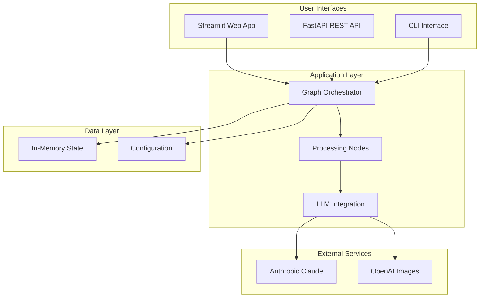
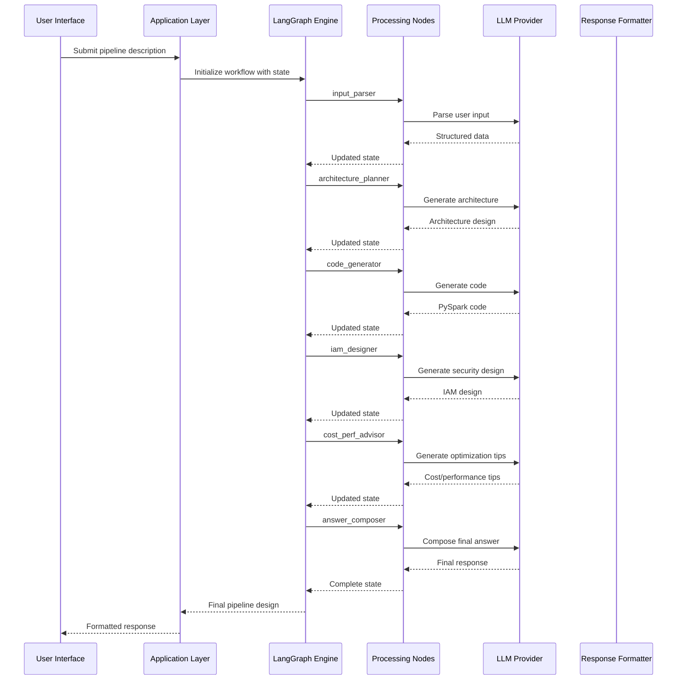

# Architecture Documentation

## Table of Contents
1. [System Overview](#system-overview)
2. [Core Components](#core-components)
3. [Data Flow](#data-flow)
4. [Technology Stack](#technology-stack)
5. [Design Patterns](#design-patterns)
6. [State Management](#state-management)
7. [Integration Points](#integration-points)
8. [Scalability Considerations](#scalability-considerations)
9. [Security Architecture](#security-architecture)
10. [Performance Optimization](#performance-optimization)

## System Overview

The AI Data Pipeline Design Assistant is a multi-interface application that helps users design comprehensive data pipelines using AI. The system takes natural language descriptions and generates complete pipeline architectures, code, and documentation.

### High-Level Architecture



### Design Goals

1. **Modularity**: Each component has a single responsibility
2. **Extensibility**: Easy to add new ETL tools and cloud platforms
3. **Maintainability**: Clear separation of concerns
4. **Performance**: Efficient LLM usage and caching
5. **Security**: Secure handling of API keys and user data
6. **Scalability**: Horizontal scaling capabilities

## Core Components

### 1. LangGraph Workflow Engine

**Location**: `src/graph.py`

The LangGraph workflow engine orchestrates the processing pipeline using a state machine approach.

#### Key Features:
- **State Management**: Typed dictionary for type safety
- **Node Orchestration**: Sequential processing with error handling
- **Extensibility**: Easy addition of new processing nodes
- **Observability**: Built-in logging and monitoring

#### Graph Structure:
```python
workflow = StateGraph(PipelineState)
workflow.add_node("input_parser", input_parser_node)
workflow.add_node("architecture_planner", architecture_planner_node)
workflow.add_node("code_generator", code_generator_node)
# ... more nodes
```

### 2. Processing Nodes

**Location**: `src/nodes/`

Each node represents a specific processing step in the pipeline design workflow.

#### Node Architecture:
```python
def node_function(state: PipelineState) -> PipelineState:
    """Process state and return updated state."""
    # Input extraction
    input_data = state.get("input_field", "")
    
    # Processing logic
    result = process_data(input_data)
    
    # State update
    state["output_field"] = result
    return state
```

#### Node Types:

1. **Input Parser** (`nodes/input_parser.py`)
   - Extracts structured data from natural language
   - Identifies cloud platform, workload type, data volume
   - Handles PII detection and security requirements

2. **Architecture Planner** (`nodes/architecture_planner.py`)
   - Designs cloud architecture based on requirements
   - Recommends appropriate services and configurations
   - Considers scalability, cost, and performance

3. **Code Generator** (`nodes/code_generator.py`)
   - Generates PySpark/Databricks code templates
   - Creates bronze-silver-gold layer implementations
   - Includes error handling and performance optimizations

4. **IAM Designer** (`nodes/iam_designer.py`)
   - Designs security architecture and access controls
   - Creates role-based access policies
   - Implements data masking and encryption strategies

5. **Cost/Perf Advisor** (`nodes/cost_perf_advisor.py`)
   - Provides cost optimization recommendations
   - Suggests performance tuning strategies
   - Estimates resource requirements

6. **Answer Composer** (`nodes/answer_composer.py`)
   - Combines all outputs into coherent responses
   - Formats content for different interfaces
   - Ensures consistency across all outputs

### 3. LLM Integration Layer

**Location**: `src/llm.py`

Provides a unified interface for different LLM providers with error handling and retry logic.

#### Key Features:
- **Provider Abstraction**: Support for multiple LLM providers
- **Error Handling**: Graceful fallbacks and retries
- **Configuration Management**: Environment-based configuration
- **Rate Limiting**: Built-in rate limit handling

#### Architecture:
```python
class LLMClient:
    def __init__(self):
        self.client = self._get_client()
    
    def _get_client(self):
        # Factory method for different providers
        if provider == "anthropic":
            return AnthropicClient()
        elif provider == "openai":
            return OpenAIClient()
    
    def call_model(self, prompt, model_params):
        # Unified interface for LLM calls
        return self.client.generate(prompt, model_params)
```

### 4. State Management

**Location**: `src/state.py`

Defines the structure of the application state using TypedDict for type safety.

#### State Structure:
```python
class PipelineState(TypedDict, total=False):
    # Input fields
    user_query: str
    
    # Parsed fields
    cloud: Optional[str]
    workload_type: Optional[str]
    source_systems: Optional[str]
    target_systems: Optional[str]
    data_volume: Optional[str]
    latency_requirements: Optional[str]
    data_sensitivity: Optional[str]
    
    # Output fields
    architecture: Optional[str]
    pyspark_code: Optional[str]
    iam_design: Optional[str]
    cost_tips: Optional[str]
    final_answer: Optional[str]
    
    # ETL tool designs
    dbt_design: Optional[str]
    snowflake_design: Optional[str]
```

## Data Flow

### Complete Pipeline Flow



### State Evolution

The state evolves through the pipeline as follows:

1. **Initial State**: Contains only `user_query`
2. **After Input Parser**: Adds parsed fields (cloud, workload_type, etc.)
3. **After Architecture Planner**: Adds `architecture`
4. **After Code Generator**: Adds `pyspark_code`
5. **After IAM Designer**: Adds `iam_design`
6. **After Cost/Perf Advisor**: Adds `cost_tips`, `performance_tips`
7. **After Answer Composer**: Adds `final_answer`

## Technology Stack

### Core Technologies

| Layer | Technology | Purpose |
|-------|------------|---------|
| Workflow | LangGraph | State machine orchestration |
| API | FastAPI | REST API server |
| UI | Streamlit | Web interface |
| CLI | Standard Library | Command-line interface |
| LLM | Anthropic Claude | AI processing |
| Testing | pytest | Test framework |
| Linting | ruff | Code quality |
| Formatting | black | Code formatting |

### Dependencies

#### Core Dependencies
- **langgraph**: Workflow orchestration
- **anthropic**: LLM integration
- **fastapi**: API server
- **streamlit**: Web interface
- **pydantic**: Data validation

#### Development Dependencies
- **pytest**: Testing framework
- **black**: Code formatting
- **ruff**: Linting
- **mypy**: Type checking
- **pre-commit**: Git hooks

## Design Patterns

### 1. State Machine Pattern

The application uses LangGraph's state machine pattern for workflow orchestration:

```python
class PipelineState(TypedDict):
    # State definition

def node_function(state: PipelineState) -> PipelineState:
    # Node implementation
    return updated_state
```

**Benefits:**
- Clear state transitions
- Easy debugging and logging
- Type safety with TypedDict
- Natural workflow representation

### 2. Strategy Pattern

Different processing strategies for various ETL tools and cloud platforms:

```python
class ETLDirector:
    def __init__(self, strategy: ETLStrategy):
        self.strategy = strategy
    
    def execute(self, state: PipelineState) -> PipelineState:
        return self.strategy.execute(state)

class TalendStrategy(ETLStrategy):
    def execute(self, state: PipelineState) -> PipelineState:
        # Talend-specific implementation
        pass

class DBTStrategy(ETLStrategy):
    def execute(self, state: PipelineState) -> PipelineState:
        # DBT-specific implementation
        pass
```

### 3. Factory Pattern

Node creation and management:

```python
class NodeFactory:
    @staticmethod
    def create_node(node_type: str) -> Callable:
        if node_type == "input_parser":
            return input_parser_node
        elif node_type == "architecture_planner":
            return architecture_planner_node
        # ... more node types
```

### 4. Dependency Injection

LLM providers and utilities are injected where needed:

```python
def create_llm_client(provider: str = "anthropic") -> LLMClient:
    if provider == "anthropic":
        return AnthropicClient(os.getenv("ANTHROPIC_API_KEY"))
    elif provider == "openai":
        return OpenAIClient(os.getenv("OPENAI_API_KEY"))
```

### 5. Observer Pattern

Event-driven updates and logging:

```python
class PipelineObserver:
    def on_node_start(self, node_name: str, state: PipelineState):
        logger.info(f"Starting node: {node_name}")
    
    def on_node_complete(self, node_name: str, state: PipelineState):
        logger.info(f"Completed node: {node_name}")
```

## State Management

### State Lifecycle

1. **Initialization**: State created with user input
2. **Transformation**: Each node transforms the state
3. **Persistence**: State maintained in memory during processing
4. **Output**: Final state returned to user

### State Immutability

The state is treated as immutable within each node:

```python
def node_function(state: PipelineState) -> PipelineState:
    # Create a copy to maintain immutability
    new_state = state.copy()
    new_state["output"] = process(state["input"])
    return new_state
```

### State Validation

State transitions are validated using TypedDict:

```python
def validate_state(state: PipelineState) -> bool:
    # Validate required fields
    required_fields = ["user_query"]
    return all(field in state for field in required_fields)
```

## Integration Points

### External API Integration

#### Anthropic Claude API

**Purpose**: AI processing for pipeline design

**Integration**:
```python
from anthropic import Anthropic

client = Anthropic(api_key=os.getenv("ANTHROPIC_API_KEY"))
response = client.messages.create(
    model="claude-3-5-sonnet-latest",
    max_tokens=2000,
    messages=[{"role": "user", "content": prompt}]
)
```

**Error Handling**:
- Rate limiting with exponential backoff
- Fallback to smaller/faster models
- Graceful degradation on API failures

#### OpenAI Image API

**Purpose**: Generate architecture diagrams

**Integration**:
```python
from openai import OpenAI

client = OpenAI(api_key=os.getenv("OPENAI_API_KEY"))
response = client.images.generate(
    model="dall-e-3",
    prompt=architecture_description,
    size="1024x1024"
)
```

### Internal API Integration

#### FastAPI Server

**Purpose**: REST API for programmatic access

**Endpoints**:
- `GET /`: Health check and information
- `POST /design`: Generate pipeline design

**Middleware**:
- CORS handling
- Request/response logging
- Error handling
- Authentication

#### Streamlit Interface

**Purpose**: Web-based user interface

**Features**:
- Interactive form for input
- Real-time progress updates
- Multiple output tabs
- Download capabilities

## Scalability Considerations

### Horizontal Scaling

The application can be scaled horizontally by:

1. **Stateless Design**: No server-side state storage
2. **Load Balancing**: Distribute requests across instances
3. **Caching**: Cache expensive LLM responses
4. **Database**: External storage for persistent data

### Performance Optimization

#### LLM Response Caching

```python
from functools import lru_cache

@lru_cache(maxsize=128)
def cached_llm_call(prompt: str, model: str) -> str:
    return call_claude(prompt, model)
```

#### Asynchronous Processing

```python
import asyncio

async def process_pipeline_async(description: str) -> PipelineState:
    # Process nodes concurrently where possible
    tasks = [
        process_architecture(description),
        process_code(description),
        process_security(description)
    ]
    results = await asyncio.gather(*tasks)
    return combine_results(results)
```

#### Resource Management

- **Connection Pooling**: Reuse HTTP connections
- **Memory Management**: Clean up large objects
- **Timeout Handling**: Prevent resource exhaustion

## Security Architecture

### Authentication and Authorization

#### API Key Management

- **Environment Variables**: Store keys securely
- **Validation**: Verify key format and permissions
- **Rotation**: Support for key rotation
- **Logging**: Never log API keys

#### Input Validation

```python
def validate_user_input(description: str) -> bool:
    # Check length
    if not description or len(description) < 10:
        return False
    
    # Check for sensitive data
    if contains_sensitive_data(description):
        return False
    
    return True
```

### Data Security

#### In-Memory Processing

- **No Persistent Storage**: Data not written to disk
- **Memory Cleanup**: Clear sensitive data after processing
- **Secure Transmission**: HTTPS for all communications

#### Sensitive Data Handling

```python
def sanitize_input(user_input: str) -> str:
    # Remove potential secrets
    sanitized = re.sub(r'password=\w+', 'password=***', user_input)
    sanitized = re.sub(r'api[_-]?key=\w+', 'api_key=***', sanitized)
    return sanitized
```

### Security Best Practices

1. **Principle of Least Privilege**: Minimal API key permissions
2. **Input Sanitization**: Validate and sanitize all inputs
3. **Error Handling**: Don't expose sensitive information in errors
4. **Logging Security**: Filter sensitive data from logs
5. **Dependency Security**: Regular security updates

## Performance Optimization

### LLM Optimization

#### Prompt Engineering

- **Structured Prompts**: Clear, specific instructions
- **Context Management**: Optimal context window usage
- **Temperature Settings**: Appropriate creativity levels
- **Token Limits**: Efficient token usage

#### Response Caching

```python
class ResponseCache:
    def __init__(self, max_size: int = 1000):
        self.cache = {}
        self.max_size = max_size
    
    def get(self, key: str) -> Optional[str]:
        return self.cache.get(key)
    
    def set(self, key: str, value: str):
        if len(self.cache) >= self.max_size:
            # Remove oldest entry
            oldest_key = next(iter(self.cache))
            del self.cache[oldest_key]
        self.cache[key] = value
```

### Application Performance

#### Concurrent Processing

```python
import concurrent.futures

def process_concurrently(tasks: List[Callable]) -> List[Any]:
    with concurrent.futures.ThreadPoolExecutor() as executor:
        return list(executor.map(lambda task: task(), tasks))
```

#### Memory Optimization

- **Generator Functions**: Stream large responses
- **Object Pooling**: Reuse expensive objects
- **Lazy Loading**: Load resources on demand

### Monitoring and Observability

#### Metrics Collection

```python
import time
from collections import defaultdict

class Metrics:
    def __init__(self):
        self.response_times = []
        self.error_counts = defaultdict(int)
        self.request_counts = 0
    
    def record_response_time(self, duration: float):
        self.response_times.append(duration)
    
    def record_error(self, error_type: str):
        self.error_counts[error_type] += 1
    
    def get_stats(self) -> dict:
        return {
            "avg_response_time": sum(self.response_times) / len(self.response_times),
            "error_rate": sum(self.error_counts.values()) / self.request_counts,
            "total_requests": self.request_counts
        }
```

#### Logging Strategy

```python
import logging

logger = logging.getLogger(__name__)

def setup_logging():
    logging.basicConfig(
        level=logging.INFO,
        format='%(asctime)s - %(name)s - %(levelname)s - %(message)s',
        handlers=[
            logging.FileHandler('app.log'),
            logging.StreamHandler()
        ]
    )
```

This architecture provides a solid foundation for a scalable, maintainable, and secure AI-powered pipeline design assistant. The modular design allows for easy extension and customization while maintaining high performance and security standards.