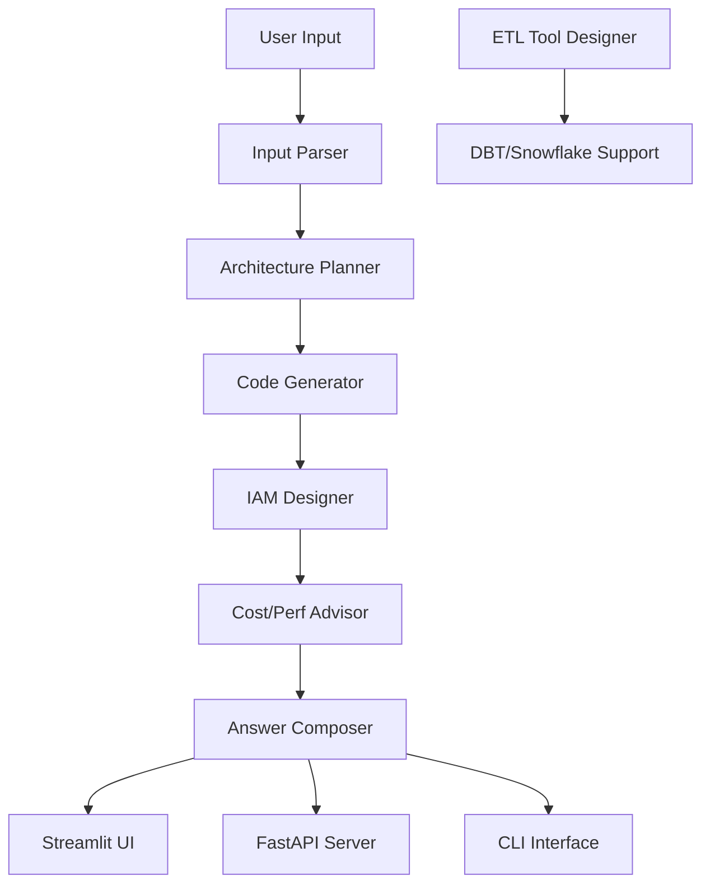

# Developer Guide

## Table of Contents
1. [Overview](#overview)
2. [Project Structure](#project-structure)
3. [Development Setup](#development-setup)
4. [Architecture](#architecture)
5. [Core Components](#core-components)
6. [LangGraph Nodes](#langgraph-nodes)
7. [Adding New Features](#adding-new-features)
8. [Testing](#testing)
9. [Code Style](#code-style)
10. [Deployment](#deployment)
11. [Contributing](#contributing)

## Overview

This guide provides comprehensive information for developers working on the AI Data Pipeline Design Assistant. The project is built using modern Python practices with LangGraph for workflow orchestration, FastAPI for the API server, and Streamlit for the web interface.

## Project Structure

```
src/
├── main.py                 # CLI entry point
├── api.py                  # FastAPI server
├── streamlit_app.py        # Streamlit web interface
├── graph.py                # LangGraph workflow definition
├── state.py                # State type definitions
├── llm.py                  # LLM integration layer
├── nodes/                  # Processing nodes
│   ├── __init__.py
│   ├── input_parser.py
│   ├── architecture_planner.py
│   ├── code_generator.py
│   ├── iam_designer.py
│   ├── cost_perf_advisor.py
│   ├── answer_composer.py
│   ├── etl_tool_designer.py
│   ├── dbt_designer.py
│   ├── snowflake_designer.py
│   └── python_designer.py
└── utils/                  # Utility modules
    ├── __init__.py
    ├── config.py
    └── logger.py

tests/                      # Test suite
├── __init__.py
├── conftest.py
├── test_main.py
├── test_api.py
├── test_streamlit.py
├── test_graph.py
└── test_nodes/

docs/                       # Documentation
├── README.md
├── USER_GUIDE.md
├── API_REFERENCE.md
├── ARCHITECTURE.md
├── DEVELOPER_GUIDE.md
└── DEPLOYMENT.md

scripts/                    # Deployment scripts
├── setup.py
└── deploy.sh

config/                     # Configuration files
├── logging.conf
└── docker-compose.yml

reference_docs/             # Reference documentation
├── cloud-architectures/
├── data-modeling/
└── etl-patterns/
```

## Development Setup

### Prerequisites
- Python 3.11+
- uv package manager
- Git

### Installation

1. **Clone the repository**
   ```bash
   git clone https://github.com/your-org/pipeline-architect.git
   cd pipeline-architect
   ```

2. **Set up development environment**
   ```bash
   # Create virtual environment
   uv venv
   
   # Activate virtual environment
   source .venv/bin/activate  # Linux/Mac
   # or
   .venv\Scripts\activate     # Windows
   
   # Install development dependencies
   uv pip install -r requirements-dev.txt
   
   # Install pre-commit hooks
   pre-commit install
   ```

3. **Configure environment**
   ```bash
   cp .env.example .env
   # Edit .env with your API keys
   ```

4. **Run development server**
   ```bash
   # Streamlit development server
   uv run streamlit run src/streamlit_app.py --server.port 8502
   
   # FastAPI development server
   uv run uvicorn src.api:app --reload --port 8001
   ```

### Development Dependencies

The development environment includes:
- **pytest**: Testing framework
- **pytest-cov**: Coverage reporting
- **black**: Code formatting
- **ruff**: Linting
- **pre-commit**: Git hooks
- **mypy**: Type checking
- **httpx**: HTTP client for testing

## Architecture

### High-Level Architecture



### Design Patterns

1. **LangGraph Workflow**: State-machine based processing
2. **Strategy Pattern**: Different ETL tool implementations
3. **Factory Pattern**: Node creation and management
4. **Dependency Injection**: LLM providers and utilities
5. **Observer Pattern**: Event-driven updates

### State Management

The application uses a state-based architecture where each node in the workflow receives and returns a `PipelineState` object:

```python
class PipelineState(TypedDict, total=False):
    user_query: str
    cloud: Optional[str]
    workload_type: Optional[str]
    # ... other fields
    architecture: Optional[str]
    pyspark_code: Optional[str]
    # ... output fields
```

## Core Components

### 1. LangGraph Workflow

The main workflow is defined in `src/graph.py`:

```python
def build_graph():
    workflow = StateGraph(PipelineState)
    
    # Register nodes
    workflow.add_node("input_parser", input_parser_node)
    workflow.add_node("architecture_planner", architecture_planner_node)
    # ... more nodes
    
    # Define edges
    workflow.set_entry_point("input_parser")
    workflow.add_edge("input_parser", "architecture_planner")
    # ... more edges
    
    return workflow.compile()
```

### 2. LLM Integration

The `src/llm.py` module provides a unified interface for LLM providers:

```python
def call_claude(system_prompt: str, user_content: str, max_tokens: int = 2000) -> str:
    client = get_client()
    resp = client.messages.create(
        model=model,
        max_tokens=max_tokens,
        temperature=0.2,
        system=system_prompt,
        messages=[{"role": "user", "content": user_content}],
    )
    return extract_text_from_response(resp)
```

### 3. Node Architecture

Each processing node follows a consistent pattern:

```python
def node_function(state: PipelineState) -> PipelineState:
    """Process state and return updated state."""
    # Extract input
    user_query = state.get("user_query", "")
    
    # Process
    result = some_processing_function(user_query)
    
    # Update state
    state["output_field"] = result
    return state
```

## LangGraph Nodes

### Node Types

1. **Input Parser** (`nodes/input_parser.py`)
   - Extracts structured data from user input
   - Identifies cloud platform, workload type, data volume
   - Handles PII detection and security requirements

2. **Architecture Planner** (`nodes/architecture_planner.py`)
   - Designs cloud architecture
   - Recommends services and configurations
   - Considers scalability and cost

3. **Code Generator** (`nodes/code_generator.py`)
   - Generates PySpark/Databricks code
   - Creates bronze-silver-gold layer implementations
   - Includes error handling and logging

4. **IAM Designer** (`nodes/iam_designer.py`)
   - Designs security architecture
   - Creates access control policies
   - Implements data masking strategies

5. **Cost/Perf Advisor** (`nodes/cost_perf_advisor.py`)
   - Provides optimization recommendations
   - Suggests resource configurations
   - Estimates costs

6. **Answer Composer** (`nodes/answer_composer.py`)
   - Combines all outputs into final answer
   - Formats for different interfaces
   - Ensures consistency

### Creating New Nodes

To add a new processing node:

1. **Create the node file**
   ```python
   # src/nodes/new_node.py
   from state import PipelineState
   from llm import call_claude
   
   SYSTEM_PROMPT = """
   You are an expert in [domain].
   Generate [output] based on the pipeline design.
   """
   
   def new_node_function(state: PipelineState) -> PipelineState:
       context = build_context(state)
       result = call_claude(SYSTEM_PROMPT, context)
       state["new_output"] = result
       return state
   ```

2. **Register the node**
   ```python
   # src/graph.py
   from nodes.new_node import new_node_function
   
   def build_graph():
       workflow = StateGraph(PipelineState)
       workflow.add_node("new_node", new_node_function)
       # ... rest of graph
   ```

3. **Update state definition**
   ```python
   # src/state.py
   class PipelineState(TypedDict, total=False):
       # ... existing fields
       new_output: Optional[str]
   ```

## Adding New Features

### 1. New ETL Tool Support

To add support for a new ETL tool:

1. **Create tool-specific node**
   ```python
   # src/nodes/tool_name_designer.py
   def tool_name_designer_node(state: PipelineState) -> PipelineState:
       # Generate tool-specific design
       design = generate_tool_design(state)
       state["tool_name_design"] = design
       return state
   ```

2. **Update streamlit interface**
   ```python
   # src/streamlit_app.py
   # Add to ETL tool selection
   etl_tool_option = st.selectbox(
       "Choose ETL tool",
       ["None", "Talend", "Informatica", "Ab Initio", "DBT", "Snowflake", "NewTool"],
   )
   
   # Add dedicated tab
   with tab_new_tool:
       st.markdown("### New Tool Design")
       st.markdown(new_tool_design)
   ```

3. **Update API response**
   ```python
   # src/api.py
   class PipelineResponse(BaseModel):
       # ... existing fields
       new_tool_design: Optional[str]
   ```

### 2. New Cloud Platform Support

To add support for a new cloud platform:

1. **Update input parser**
   ```python
   # src/nodes/input_parser.py
   # Add platform detection
   if "gcp" in user_query.lower() or "google cloud" in user_query.lower():
       state["cloud"] = "gcp"
   ```

2. **Update architecture planner**
   ```python
   # src/nodes/architecture_planner.py
   if cloud == "gcp":
       # Generate GCP-specific architecture
       architecture = generate_gcp_architecture(context)
   ```

3. **Update code generator**
   ```python
   # src/nodes/code_generator.py
   if cloud == "gcp":
       # Generate GCP-specific code
       code = generate_gcp_code(context)
   ```

### 3. New Output Format

To add a new output format:

1. **Create formatter function**
   ```python
   # src/utils/formatters.py
   def format_as_markdown(content: str) -> str:
       # Format content as markdown
       return formatted_content
   
   def format_as_json(content: str) -> str:
       # Format content as JSON
       return json.dumps(content, indent=2)
   ```

2. **Update answer composer**
   ```python
   # src/nodes/answer_composer.py
   def answer_composer_node(state: PipelineState) -> PipelineState:
       # ... existing code
       
       # Add new format
       state["final_answer_markdown"] = format_as_markdown(final_answer)
       state["final_answer_json"] = format_as_json(final_answer)
       
       return state
   ```

## Testing

### Test Structure

```python
# tests/test_main.py
def test_pipeline_execution():
    """Test complete pipeline execution."""
    from main import run_pipeline
    
    description = "Test pipeline description"
    result = run_pipeline(description)
    
    assert "architecture" in result
    assert "pyspark_code" in result

def test_api_endpoint():
    """Test API endpoint."""
    from fastapi.testclient import TestClient
    from api import app
    
    client = TestClient(app)
    response = client.post("/design", json={
        "description": "Test description"
    })
    
    assert response.status_code == 200
    data = response.json()
    assert "final_answer" in data

def test_streamlit_app():
    """Test Streamlit app components."""
    import streamlit as st
    
    # Test that app runs without errors
    st.set_page_config(page_title="Test")
    assert st.get_option("page_title") == "Test"
```

### Running Tests

```bash
# Run all tests
uv run pytest tests/

# Run with coverage
uv run pytest tests/ --cov=src

# Run specific test
uv run pytest tests/test_api.py

# Run integration tests
uv run pytest tests/ -m integration

# Run linting
uv run ruff check src/

# Run formatting
uv run black src/

# Run type checking
uv run mypy src/
```

### Test Fixtures

```python
# tests/conftest.py
import pytest
from state import PipelineState

@pytest.fixture
def sample_state() -> PipelineState:
    return {
        "user_query": "Test pipeline description",
        "cloud": "azure",
        "workload_type": "batch",
        "data_volume": "~200GB/day"
    }

@pytest.fixture
def sample_architecture() -> str:
    return """
    ## Architecture Overview
    
    **Services Used:**
    - Azure Blob Storage (Raw Data Landing)
    - Azure Databricks (Processing)
    - Delta Lake (Storage)
    """
```

### Mocking External Services

```python
# tests/test_llm.py
from unittest.mock import patch
from llm import call_claude

@patch('llm.get_client')
def test_call_claude(mock_get_client):
    """Test LLM integration with mocking."""
    mock_client = mock_get_client.return_value
    mock_client.messages.create.return_value = MockResponse()
    
    result = call_claude("System prompt", "User content")
    
    assert result is not None
    mock_client.messages.create.assert_called_once()
```

## Code Style

### Formatting

The project uses **Black** for code formatting:

```bash
# Format all code
uv run black src/ tests/ docs/

# Check formatting
uv run black --check src/ tests/ docs/
```

### Linting

The project uses **Ruff** for linting:

```bash
# Run linting
uv run ruff check src/ tests/

# Auto-fix issues
uv run ruff check --fix src/ tests/
```

### Type Checking

The project uses **MyPy** for type checking:

```bash
# Run type checking
uv run mypy src/

# Per-file checking
uv run mypy src/main.py
```

### Pre-commit Hooks

Pre-commit hooks ensure code quality:

```bash
# Run pre-commit on all files
uv run pre-commit run --all-files

# Install pre-commit hooks
pre-commit install
```

### Code Style Guidelines

1. **Imports**: Group imports and sort them
2. **Line Length**: Maximum 88 characters (Black default)
3. **Docstrings**: Use Google style docstrings
4. **Type Hints**: Always use type hints
5. **Naming**: Use snake_case for functions and variables

```python
from typing import List, Dict, Optional

def process_pipeline(
    user_query: str,
    cloud_platform: Optional[str] = None,
    workload_type: Optional[str] = None
) -> Dict[str, str]:
    """Process pipeline description and generate design.
    
    Args:
        user_query: Natural language pipeline description
        cloud_platform: Target cloud platform (azure/aws/gcp)
        workload_type: Type of workload (batch/streaming)
    
    Returns:
        Dictionary containing pipeline design components
    """
    # Implementation here
    pass
```

## Deployment

### Local Development

```bash
# Run with uv
uv run streamlit run src/streamlit_app.py
uv run uvicorn src.api:app --reload
uv run python src/main.py
```

### Docker Deployment

```bash
# Build image
docker build -t pipeline-architect .

# Run container
docker run -p 8501:8501 \
  -e ANTHROPIC_API_KEY=$ANTHROPIC_API_KEY \
  pipeline-architect

# Using Docker Compose
docker-compose up -d
```

### Production Deployment

1. **Environment Setup**
   ```bash
   # Set production environment variables
   export ENVIRONMENT=production
   export LOG_LEVEL=INFO
   
   # Use production dependencies
   uv pip install -r requirements.txt
   ```

2. **Security Configuration**
   ```bash
   # Enable HTTPS
   # Configure reverse proxy (nginx)
   # Set up monitoring and logging
   # Implement rate limiting
   ```

3. **Scaling**
   ```bash
   # Use process managers (gunicorn, uvicorn)
   # Configure load balancing
   # Set up health checks
   # Monitor resource usage
   ```

### CI/CD Pipeline

```yaml
# .github/workflows/ci.yml
name: CI/CD Pipeline

on:
  push:
    branches: [ main ]
  pull_request:
    branches: [ main ]

jobs:
  test:
    runs-on: ubuntu-latest
    
    steps:
    - uses: actions/checkout@v3
    - uses: uv@v1
      with:
        uv-version: "latest"
    
    - name: Install dependencies
      run: uv pip install -r requirements-dev.txt
    
    - name: Run tests
      run: pytest tests/
    
    - name: Run linting
      run: ruff check src/ tests/
    
    - name: Run type checking
      run: mypy src/
  
  deploy:
    needs: test
    runs-on: ubuntu-latest
    if: github.ref == 'refs/heads/main'
    
    steps:
    - uses: actions/checkout@v3
    - uses: uv@v1
      with:
        uv-version: "latest"
    
    - name: Build Docker image
      run: docker build -t pipeline-architect .
    
    - name: Deploy to staging
      run: |
        # Deployment steps
```

## Contributing

### Development Workflow

1. **Fork the repository**
2. **Create a feature branch**
   ```bash
   git checkout -b feature/your-feature-name
   ```
3. **Make your changes**
4. **Write tests for your changes**
5. **Run the test suite**
   ```bash
   uv run pytest tests/
   ```
6. **Run linting and formatting**
   ```bash
   uv run ruff check src/
   uv run black src/
   ```
7. **Commit your changes**
   ```bash
   git add .
   git commit -m "feat: Add your feature description"
   ```
8. **Push to your fork**
   ```bash
   git push origin feature/your-feature-name
   ```
9. **Create a pull request**

### Pull Request Guidelines

1. **Description**: Provide a clear description of your changes
2. **Testing**: Ensure all tests pass
3. **Documentation**: Update documentation for new features
4. **Breaking Changes**: Clearly mark any breaking changes
5. **Dependencies**: Document any new dependencies

### Code Review Process

1. **Automated Checks**: All CI/CD checks must pass
2. **Code Style**: Follow project coding standards
3. **Tests**: Include comprehensive tests
4. **Documentation**: Update relevant documentation
5. **Performance**: Consider performance implications

### Issue Reporting

When reporting issues:

1. **Search existing issues** first
2. **Provide detailed reproduction steps**
3. **Include environment information** (Python version, OS, etc.)
4. **Add relevant logs** or error messages
5. **Provide minimal reproducible examples**

### Feature Requests

To request new features:

1. **Create an issue** with the `feature-request` label
2. **Describe the feature** and its benefits
3. **Provide use cases** and examples
4. **Consider implementation** approach
5. **Be open to discussion** and alternatives

## Best Practices

### Security

1. **Never commit secrets** to the repository
2. **Use environment variables** for configuration
3. **Validate all inputs** to prevent injection attacks
4. **Use HTTPS** for all communications
5. **Implement proper access controls**

### Performance

1. **Cache expensive operations** when possible
2. **Use asynchronous processing** for I/O operations
3. **Optimize LLM calls** with appropriate timeouts
4. **Monitor resource usage**
5. **Implement rate limiting**

### Maintainability

1. **Write clear, descriptive commit messages**
2. **Use meaningful variable and function names**
3. **Document complex logic** with comments
4. **Follow DRY principles**
5. **Refactor regularly** to reduce technical debt

### Testing

1. **Write tests for all new features**
2. **Maintain high test coverage**
3. **Test edge cases** and error conditions
4. **Use meaningful test names**
5. **Keep tests independent** and fast

For questions or support, please refer to our [User Guide](USER_GUIDE.md) or [create an issue](https://github.com/your-org/pipeline-architect/issues).